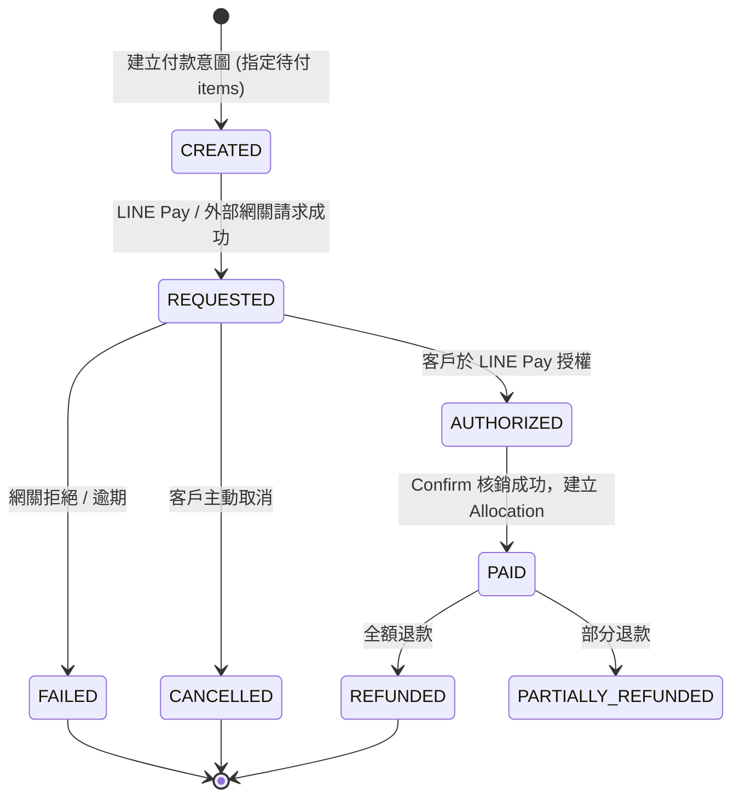

# 項目級付款狀態機與金流分配規格書 (Payment State Machine & Allocations)

> 依據需求書：第 19 節至第 24 節、第 75 節、第 85 節  
> 核心鐵律：**「訂單是否已付款」是計算屬性；真正的付款狀態嚴格記錄在單一品項 (Item) 與支付分配 (Payment Allocation)。**

---

## 1. 狀態生命週期模型

### 1.1 訂單項目狀態 (Order Item Payment Status)
```text
UNPAID (未付款)
  │
  ├─ (支付全額) ───► PAID (已付款)
  │
  ├─ (部分付款) ───► PARTIALLY_PAID (部分付款)
  │                    │
  │                    └─ (補足差額) ───► PAID
  │
  └─ (作廢) ───────► VOIDED
```

### 1.2 支付交易狀態 (Payment Record Status)


### 1.3 訂單總體狀態 (Calculated Order Status)
- `OPEN`：所有項目皆 `UNPAID`。
- `PARTIALLY_PAID`：已付金額 > 0 且 尚有待付款金額 (`due_total > 0`)。
- `PAID`：所有有效項目的待付款金額皆為 0 (`due_total == 0`)。
- `COMPLETED`：所有項目皆已履約交付。

---

## 2. 項目級支付分配模型 (Payment Allocation Engine)

### 2.1 資料結構關聯
```text
[ orders ] 1 ─── * [ order_items ] (如：剪髮 $600、護髮 $800、染髮 $2000)
    │                     ▲
    │                     │ allocated to
    ▼                     │
[ payments ] 1 ─── * [ payment_allocations ] (記錄 payment_id + order_item_id + amount)
```

### 2.2 範例運作情境 (Scenario Walkthrough)
1. **線上預約點單**：
   - 項目 A: 剪髮 ($600) -> `UNPAID`
   - 項目 B: 護髮 ($800) -> `UNPAID`
   - 項目 C: 染髮 ($2000) -> `UNPAID`
   - 訂單總額: $3400，待付: $3400。
2. **第一階段付款 (顧客透過 LINE Pay 先結 A 與 B)**：
   - 後端核算 A ($600) + B ($800) = $1400。
   - 向 LINE Pay 發起請求並完成 Confirm。
   - 產生 `Payment 1` ($1400, `PAID`)。
   - 產生 `Allocation 1` (A, $600) -> 項目 A 變更為 `PAID`。
   - 產生 `Allocation 2` (B, $800) -> 項目 B 變更為 `PAID`。
   - 訂單總額: $3400，已付: $1400，待付: $2000 (`PARTIALLY_PAID`)。
3. **現場到店追加服務**：
   - 店員現場協助追加項目 D: 頭皮護理 ($500) -> `UNPAID`。
   - 訂單總額更新為: $3900，待付金額自動重算為: $2500。
4. **第二階段結帳 (現場店員收取 C 與 D 現金)**：
   - 店員勾選待付品項 C ($2000) + D ($500) = $2500。
   - 選擇付款方式 `CASH`，確認收款完成。
   - 產生 `Payment 2` ($2500, `PAID`, provider=`MANUAL_CASH`)。
   - 產生 `Allocation 3` (C, $2000) -> 項目 C 變更為 `PAID`。
   - 產生 `Allocation 4` (D, $500) -> 項目 D 變更為 `PAID`。
   - 訂單總額: $3900，已付: $3900，待付: $0 -> 訂單轉為 `PAID`。

---

## 3. LINE Pay Online API v4 伺服器端簽章與安全機制

### 3.1 核心原則
1. **嚴禁前端自訂金額**：客戶端僅傳入 `orderId` 與欲支付的 `orderItemIds` 清單，應付金額**百分之百由後端即時計算**。
2. **HMAC-SHA256 簽署**：
   ```text
   Signature = Base64(HMAC-SHA256(
     LINE_PAY_CHANNEL_SECRET,
     LINE_PAY_CHANNEL_SECRET + URI + RequestBodyString + Nonce
   ))
   ```
3. **Confirm 防重刷與雙重驗算**：
   - 瀏覽器 Redirect 回來**不代表**付款成功。
   - 後端接收 Confirm 回呼時，必須呼叫 `POST /v4/payments/{transactionId}/confirm`。
   - 成功後在同一 DB Transaction 內鎖定該 Payment 記錄與對應 Order Items，確認狀態與金額一致後才標記 `PAID`。
   - 針對 Confirm 頁面重新整理或重複 Callback，具備冪等保護，絕不重複累加收款。
