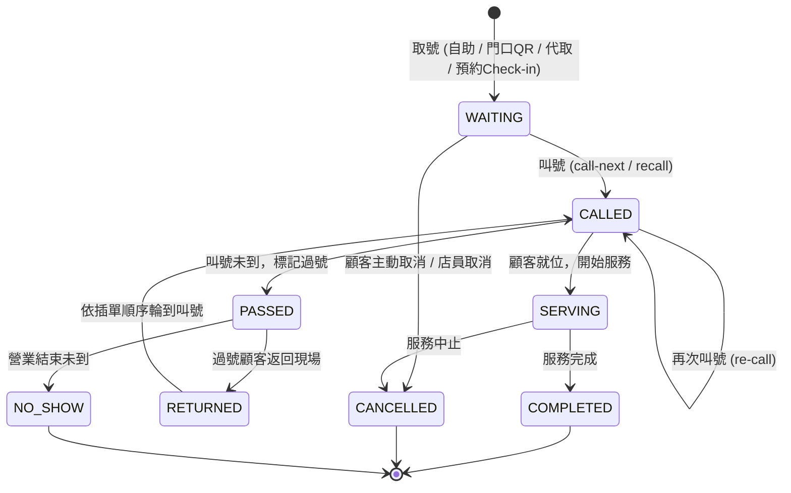

# 排隊叫號狀態機與排序規格書 (Queue State Machine & Sequencing)

> 依據需求書：第 12 節至第 16 節、第 50 節至第 51 節、第 96 節  
> 核心鐵律：**「號碼」是顧客永久識別；「順序」是營運狀態，兩者嚴格分離。**

---

## 1. 票券狀態轉換圖 (Ticket Lifecycle)



---

## 2. 狀態轉換矩陣與後端行為

| 原狀態 | 目標狀態 | 觸發動作 | 允許角色 | 必要系統副作用 (Side-Effects) |
| :--- | :--- | :--- | :--- | :--- |
| `[*] (None)` | `WAITING` | 取號 / Check-in | Customer, Staff | 產生永久 `ticket_number` (例如 A051)，分配初始 `queue_position`，寫入 `TICKET_CREATED` 事件。 |
| `WAITING` | `CALLED` | 叫號 (`call-next`) | Staff, Manager, Owner | 設定 `called_at`，推播 LINE 叫號提醒，寫入 `TICKET_CALLED` 事件。 |
| `CALLED` | `SERVING` | 開始服務 | Staff, Manager, Owner | 設定 `service_started_at`，更新當前服務對象。 |
| `CALLED` | `PASSED` | 過號 | Staff, Manager, Owner | 設定 `passed_at`，自等待佇列移除排序，推播過號通知，寫入 `TICKET_PASSED` 事件。 |
| `PASSED` | `RETURNED` | 過號回來插單 | Staff, Manager, Owner | 將該票券狀態轉為 `RETURNED`，動態計算新排序 (`insert-next` 或尾端)，寫入 `TICKET_RETURNED` 事件。 |
| `RETURNED` | `CALLED` | 叫號 | Staff, Manager, Owner | 設定 `called_at`，推播叫號提醒。 |
| `SERVING` | `COMPLETED` | 服務完成 | Staff, Manager, Owner | 設定 `completed_at`，釋放當前服務席位，寫入 `SERVICE_COMPLETED`。 |
| `ANY_ACTIVE`| `CANCELLED` | 取消 | Customer (限本人 WAITING), Staff | 標記取消時間與原因，釋放重複取號額度限制。 |

---

## 3. 排序模型演算法 (Decoupled Sequencing Algorithm)

### 3.1 為什麼不能用 `current_number`
若目前叫號至 50 號，25 號過號客回到現場，若直接將當前叫號改為 25，流水號將陷入倒退錯亂（50 -> 25 -> 51?），導致等待人數、預估時間與防跳號統計全數失真。

### 3.2 排序資料表結構 (`queue_positions`)
```text
queue_positions:
  - id: UUID
  - queue_id: UUID
  - ticket_id: UUID (Unique)
  - sort_key: DECIMAL(12, 6) / LexoRank String
  - inserted_reason: NORMAL | INSERT_NEXT | RETURNED
  - created_at: TIMESTAMP
```

### 3.3 插單至下一位 (`insert-next`) 運算邏輯
假設當前佇列情況如下：
- `Serving Ticket`: 50
- `Waiting Ticket 1`: 51 (sort_key = 1000.00)
- `Waiting Ticket 2`: 52 (sort_key = 2000.00)
- `Waiting Ticket 3`: 53 (sort_key = 3000.00)

過號客 25 號回到現場，店員點選「25 號安排下一位」：
1. 取得目前排在第一順位的待叫號票券 (51 號，key = 1000.00)。
2. 計算 25 號的新 `sort_key`：`sort_key = 1000.00 / 2 = 500.00`。
3. 更新後候位順序為：`50 (Serving) -> 25 (key: 500) -> 51 (key: 1000) -> 52 (key: 2000) -> 53 (key: 3000)`。
4. 當 50 號完成並點選「下一位」時，系統按 `sort_key ASC` 取出下一張，精準呼叫 25 號！
5. 25 號完成後，下一個依然依序呼叫 51 號，完美不失真。

---

## 4. 並行叫號防護 (Concurrency Safety)

為防止兩位店員於尖峰時刻同時點擊「下一位」導致重複叫號或連續跳號：
1. **資料庫層級 Row Lock**：
   在執行 `call-next` 時，使用 PostgreSQL `SELECT ... FOR UPDATE` 鎖定該分店當日的 `queues` 記錄。
2. **客戶端請求冪等鍵 (Idempotency-Key)**：
   每次點擊按鈕帶上 UUID，若發生網路重發或雙擊，直接由快取/資料庫回傳相同結果，絕不觸發第二次狀態推進。
