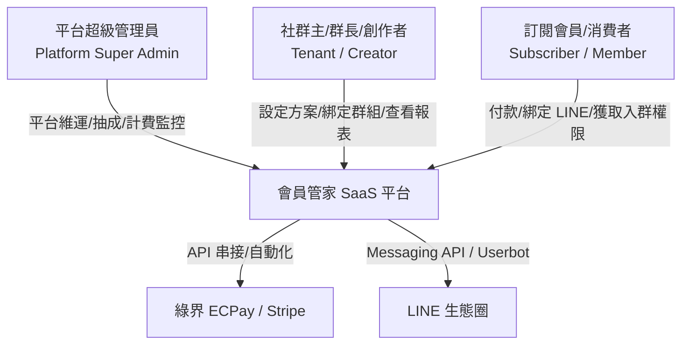
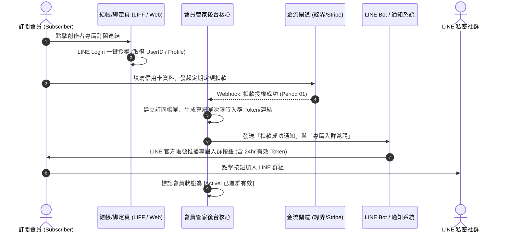
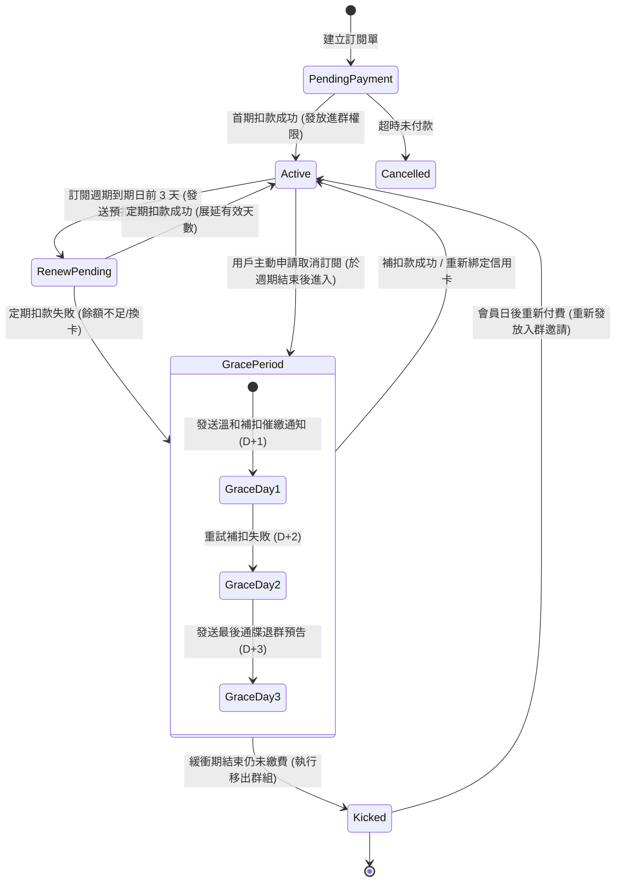
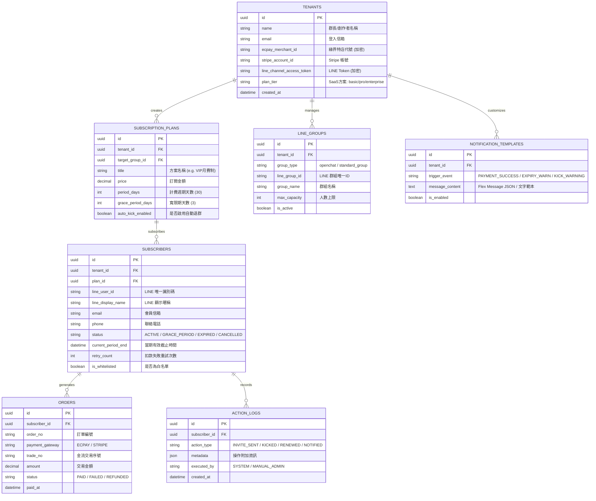
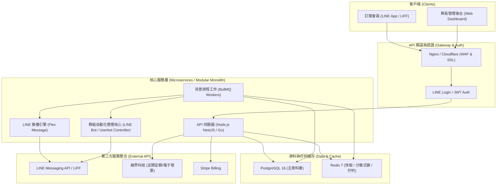
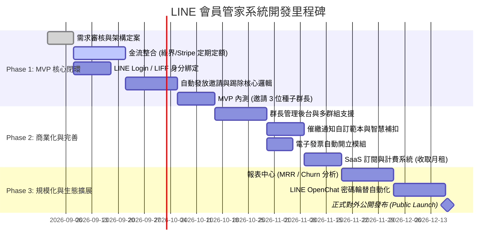

# LINE 私密訂閱社群「會員管家」系統需求規格書 (SRS)
> **System Requirements Specification (SRS) - Auto-Subscription & Group Access Manager for LINE Communities**
> **文件版本**：v1.0.0  
> **建立日期**：2026-08-19  
> **適用專案**：LINE 私密訂閱社群「到期自動退群與催繳」SaaS 會員管家系統

---

## 1. 專案概述 (Project Overview)

### 1.1 背景與市場痛點
台灣市場中，創作者、投資達人、知識付費專家與線上講師極度依賴 **LINE 私密群組/社群** 進行高價值付費內容交付與社群變現（如盤後解析、VIP 互動、付費諮詢）。  
目前主流模式多為「定期定額月費制」，然而 LINE 原生生態並未提供自動化訂閱管理與權限到期自動踢除機制。

**核心痛點**：
1. **人工核帳成本極高**：群長每月需手動比對銀行/刷卡流水與 LINE 暱稱，耗時耗力。
2. **人情尷尬與防漏困難**：逾期未繳者需人工逐一發私訊催繳或手動踢除，容易引發社群負面情緒與人情負擔。
3. **白嫖/蹭課漏洞**：逾期用戶若群長漏踢，可持續享有 VIP 內容，造成付費用戶不公。
4. **營收流失**：缺乏自動化催繳與智慧補扣機制，因換卡過期、餘額不足導致自然流失（Churn Rate）高。

### 1.2 系統願景與核心價值
本系統（以下簡稱「會員管家」）定位為 **B2B / B2Creator 訂閱社群自動化管理 SaaS**，旨在：
- **全自動化生命週期管理**：串接主流金流（綠界科技 ECPay、Stripe），達成「付款成功自動發放限時入群 Token ➔ 到期自動預警催繳 ➔ 扣款失敗/退訂自動移出群組」。
- **極致平滑的用戶體驗**：透過 LINE Login 與 LIFF 實現一鍵綁定與入群，降低付費用戶操作門檻。
- **解放創作者生產力**：徹底實現「零手動介入」的社群營收閉環。

---

## 2. 系統角色與使用者畫像 (User Personas)

### 2.1 角色定義
1. **訂閱會員 (Subscriber)**：
   - 終端消費者，於創作者頁面訂閱服務、完成定期定額授權、綁定 LINE 帳號，並享有有效期間內的私密群入群權限。
2. **群長 / 創作者 (Tenant / Admin)**：
   - SaaS 的付費用戶（B端），在後台建立訂閱方案、綁定 LINE 官方帳號/群組、設定催繳通知範本與權限緩衝期。
3. **平台超級管理員 (Platform Super Admin)**：
   - SaaS 運營方，負責租戶管理、SaaS 訂閱收費、系統監控、金流網關調度與系統日誌審計。

---

## 3. 系統業務流程與狀態機 (Business Workflows)

### 3.1 會員訂閱與自動入群主流程

### 3.2 續費、催繳與自動退群狀態機 (Lifecycle State Machine)

---

## 4. 功能性需求規格 (Functional Requirements)

### 4.1 模組一：金流與定期定額扣款系統 (Payment & Subscription Engine)
| 需求編號 | 功能項目 | 詳細需求描述 | 優先級 |
| :--- | :--- | :--- | :--- |
| **FR-PAY-01** | 多金流定期定額支援 | 1. 支援**綠界科技 (ECPay)** 定期定額 API (支援信用卡定期定額)。 2. 支援 **Stripe Billing** (支援全球信用卡、Apple Pay、Google Pay)。 | P0 |
| **FR-PAY-02** | 彈性訂閱週期配置 | 支援按月、按季、按年扣款方案，群長可自訂試用期天數 (Trial Period) 或早鳥折扣券。 | P0 |
| **FR-PAY-03** | 智慧補扣與重試機制 | 扣款失敗後，系統於緩衝期內 (預設 D+1, D+2, D+3) 自動發起排程補扣，降低流失率。 | P0 |
| **FR-PAY-04** | 信用卡更換自助門市 | 提供會員專屬 LIFF 門市頁面，扣款失敗時可由 LINE 推播一鍵開啟更新信用卡資訊。 | P0 |
| **FR-PAY-05** | 電子發票自動開立 | 串接綠界/鯨躍等電子發票 API，定期扣款成功後自動開立發票並發送 Email / 載具歸戶。 | P1 |

---

### 4.2 模組二：LINE 身分識別與權限綁定 (LINE Identity & LIFF Binding)
| 需求編號 | 功能項目 | 詳細需求描述 | 優先級 |
| :--- | :--- | :--- | :--- |
| **FR-LIN-01** | LINE Login 整合 | 結帳流程強制或無縫結合 LINE Login，取得用戶唯一 `line_user_id`、頭像與暱稱。 | P0 |
| **FR-LIN-02** | 唯一身分與防盜機制 | 一組訂閱權限僅能綁定單一 LINE 帳號，禁止同一訂單轉發邀請連結予他人使用。 | P0 |
| **FR-LIN-03** | 專屬動態入群 Token | 系統產生具時效性 (如 24 小時) 之專屬入群邀請連結，使用後即刻作廢，防止連結外流。 | P0 |
| **FR-LIN-04** | 會員自助服務中心 (LIFF) | 會員可在 LINE 官方帳號內點擊圖文選單 (Rich Menu) 查詢目前訂閱狀態、發票紀錄、扣款日與更改付款卡片。 | P1 |

---

### 4.3 模組三：群組生命週期自動化管理 (Community Access Automation)
> **技術方案評估與架構設計**：  
> LINE 原生 Messaging API 對一般群組不具備踢除單一特定成員的 API。本系統支援雙軌/混合架構以符合不同群組型態與法規限制：
> - **架構 A (LINE OpenChat 社群/密碼制)**：每月/每週自動輪替社群進群密碼，透過 Bot 僅發放新密碼給有效訂閱者，並於背景比對未續費用戶清單供管理員一鍵核對/批次移除。
> - **架構 B (LINE 專屬管理助理帳號 / Userbot Automation)**：透過專用服務機器人常駐群組，接收 Webhook 指令執行自動踢除（適用於一般 VIP 群組）。
> - **架構 C (1-on-1 專屬頻道 / 官方帳號 Audience Group 分眾)**：透過 Messaging API 標籤與 Audience Group 動態管理進階私密推播權限。

| 需求編號 | 功能項目 | 詳細需求描述 | 優先級 |
| :--- | :--- | :--- | :--- |
| **FR-GRP-01** | 自動入群邀請派發 | 扣款成功瞬間，由 LINE 官方帳號自動發送專屬邀請卡片（Flex Message）。 | P0 |
| **FR-GRP-02** | 逾期自動移出群組 | 緩衝期結束仍未完成續費者，系統自動調度執行移出群組作業，並記錄審計日誌。 | P0 |
| **FR-GRP-03** | 溫和多階段催繳通知 | 支援扣款日前預警、扣款失敗通知、緩衝期最後通牒通知（支援自訂文案與 Emoji）。 | P0 |
| **FR-GRP-04** | 主動退訂停權處置 | 會員主動取消訂閱後，系統保留權限直至當期計費週期結束，屆期自動退群。 | P0 |
| **FR-GRP-05** | 人工人情豁免/白名單 | 群長可將特定 VIP、親友、助教設為「永久白名單」或「自訂有效到期日」，免遭自動踢除。 | P1 |

---

### 4.4 模組四：創作者/群長管理後台 (Creator Management Console)
| 需求編號 | 功能項目 | 詳細需求描述 | 優先級 |
| :--- | :--- | :--- | :--- |
| **FR-ADM-01** | 多群組與多方案管理 | 支援單一群長管理多個 LINE 群組（例如：入門群、進階群、全方位群），各群對應不同定價方案。 | P0 |
| **FR-ADM-02** | 即時成員監控總表 | 清晰展示所有成員清單：LINE 暱稱、綁定電話、訂閱狀態 (Active / Grace / Expired)、累計付費金額、進群時間。 | P0 |
| **FR-ADM-03** | 智慧通知文案編輯器 | 提供視覺化範本編輯器，可自訂催繳、入群歡迎、扣款失敗等 LINE 推播訊息範本（支援變數動態置換：`{name}`, `{days_left}`, `{pay_url}`）。 | P1 |
| **FR-ADM-04** | 財務與營運分析報表 | 提供 MRR (月經常性營收)、ARR、Churn Rate (流失率)、LTV (用戶終身價值) 與續約率可視化圖表。 | P1 |
| **FR-ADM-05** | 手動強制進/退群操作 | 緊急情況下，群長可直接在後台手動發送補償天數、強制踢除或重發入群邀請。 | P1 |

---

### 4.5 模組五：SaaS 平台計費與租戶系統 (SaaS Billing & Multi-Tenancy)
| 需求編號 | 功能項目 | 詳細需求描述 | 優先級 |
| :--- | :--- | :--- | :--- |
| **FR-SAS-01** | 階梯式 SaaS 訂閱計費 | 依據群長的**在線活躍會員總數**分級收費（例如：$19/月 支援 100 人；$49/月 支援 500 人；$99/月 支援 2,000 人）。 | P0 |
| **FR-SAS-02** | 租戶獨立隔離 (Multi-Tenant) | 各創作者資料、金流金鑰 (API Key / Secret) 與群組資料完全邏輯隔離，確保資料隱私。 | P0 |
| **FR-SAS-03** | 超額用量監控與預警 | 當群長會員數接近方案上限時，主動發送升級提醒與自動擴展授權。 | P1 |

---

## 5. 非功能性需求規格 (Non-Functional Requirements)

### 5.1 安全性與法規相符性 (Security & Compliance)
- **SEC-01 (金流安全)**：系統不儲存任何信用卡號與 CVC。所有交易均透過金流 Tokenization 進行，符合 **PCI-DSS Level 1** 規範。
- **SEC-02 (機密金鑰加密)**：創作者設定的綠界 MerchantID / HashKey / HashIV 及 LINE Channel Secret 於資料庫中必須採用 **AES-256-GCM** 加密儲存。
- **SEC-03 (存取權限控管)**：後台 API 採用 JWT + RBAC (基於角色的存取控制)，所有敏感操作皆記錄於不可更動之 Audit Log。
- **SEC-04 (個資法合規)**：符合台灣《個人資料保護法》，支援會員資料去識別化與「被遺忘權」清理功能。

### 5.2 可靠性、容錯與冪等性 (Reliability & Idempotency)
- **REL-01 (金流 Webhook 冪等性)**：所有金流回呼 API 必須以 `transaction_id` 或 `order_no` 建立分散式鎖 (Distributed Lock / Redis) 與冪等校驗，嚴禁重複入帳或重複發放權限。
- **REL-02 (非同步隊列與重試機制)**：踢人、推播等外部依賴作業必須置於訊息佇列 (RabbitMQ / Redis BullMQ)，具備指數退避重試 (Exponential Backoff) 與死信佇列 (DLQ) 機制。
- **REL-03 (SLA 保證)**：系統可用性目標達 **99.9%**，支援核心排程與 Webhook 服務無中斷部署。

### 5.3 效能與可擴展性 (Performance & Scalability)
- **PER-01 (低延遲推播)**：扣款成功至 LINE 邀請訊息送達終端用戶，延遲時間需在 **3 秒** 以內。
- **PER-02 (批次排程效能)**：每日排程之扣款與催繳掃描可在 5 分鐘內處理 100,000+ 筆會員狀態。
- **PER-03 (快取加速)**：會員當前權限狀態與方案設定存於 Redis，讀取查詢反應時間 < 50ms。

---

## 6. 資料庫模型設計 (Data Schema Design)

---

## 7. 系統架構與技術選型 (Technical Architecture)

### 7.1 技術棧推薦清單 (Recommended Tech Stack)
1. **後端技術**：
   - **核心框架**：Node.js (NestJS / TypeScript) 或 Go (Golang)，兼具高併發與強型別安全性。
   - **排程與佇列**：BullMQ + Redis 7，負責定期定額定時輪詢、補扣款觸發與退群排程。
   - **資料庫**：PostgreSQL 16 (關聯資料與審計日誌) + Prisma / Drizzle ORM。
2. **前端技術**：
   - **後台管理系統**：Next.js 14 (App Router) + Tailwind CSS + Shadcn UI + TanStack Query。
   - **會員端頁面**：LIFF (LINE Front-end Framework) + Vue 3 / React SPA（極速載入）。
3. **基礎架構與維運**：
   - **容器化與部署**：Docker + Docker Compose / Kubernetes (GKE 或 AWS ECS)。
   - **日誌與監控**：Prometheus + Grafana + Sentry (異常錯誤即時報警)。

---

## 8. 專案開發里程碑與上線時程 (Project Roadmap)

---

## 9. 風險分析與因應對策 (Risk Assessment)

| 風險項目 | 風險等級 | 潛在影響 | 因應對策 |
| :--- | :---: | :--- | :--- |
| **LINE API 政策變動或群組踢人限制** | **高** | 若依賴非官方協定可能面臨風控或帳號封鎖 | **雙軌備援架構**：提供標準 LINE Bot、OpenChat 動態換密碼機制、以及官方帳號 1-on-1 標籤推播作為合規解決方案。 |
| **定期定額信用卡扣款失敗率高** | **中** | 影響創作者營收與續約率 | 實施 **D+1/D+2/D+3 智慧補扣** + LINE 官方帳號推播一鍵換卡門市，大幅降低非自願流失。 |
| **用戶重複使用入群邀請連結** | **中** | 未付費者透過外洩連結免費入群 | 入群連結採用 **One-Time Token (單次有效/24hr 時效)**，並於進入群組時即時校驗 LINE UserID。 |
| **綠界/Stripe Webhook 延遲或遺漏** | **低** | 會員付款成功卻未及時收到邀請 | 建立主動輪詢機制 (Reconciliation Polling Job)，每 15 分鐘對未完成對帳單進行主動 Query API 校正。 |

---

## 10. 結語與驗收準則 (Acceptance Criteria)

### 10.1 驗收標準 (Definition of Done)
1. **付款至進群自動化**：測試人員於結帳頁完成綠界定期定額刷卡後，需在 **5 秒內** 於 LINE 官方帳號收到個人專屬入群邀請，且點擊後能順利進群。
2. **扣款失敗催繳測試**：模擬扣款失敗時，系統於 1 分鐘內發送催繳推播，點擊推播能成功開啟 LIFF 換卡頁面。
3. **到期自動踢除測試**：將訂閱設定為過期狀態且超過緩衝天數後，排程需在 **3 分鐘內** 自動將該成員移出群組，並寫入審計日誌。
4. **防盜機制驗證**：已使用過之邀請連結或非綁定之 LINE 帳號點擊邀請連結，系統需直接阻擋並提示「連結已失效」。
