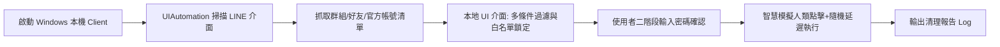
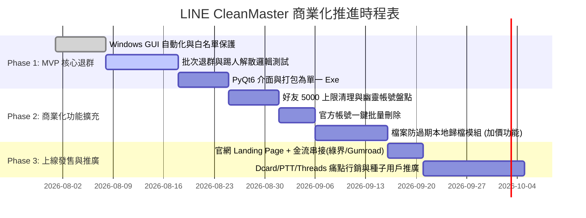

# LINE 100 大痛點商業價值評估與產品落地規劃書

> **核心目標**：從《LINE使用痛點100大調查》中提煉出**付費意願最高 (WTP)**、**技術可行性高**且**市場規模龐大**的商業機會，規劃出可具體落地的軟體產品、技術架構、商業模式與執行步驟。

---

## 📊 商業價值篩選維度 (Evaluation Framework)

並非所有痛點都值得做成商業產品（例如「通話接不到/破音」屬於 LINE 底層 VoIP 協定與 iOS 系統層限制，第三方難以干預）。我們採用以下 4 大維度篩選具有高度商業變現價值的項目：

```mermaid
quadrantChart
    title LINE 痛點商業價值矩陣
    x-axis 低技術可行性 --> 高技術可行性 (可第三方落地)
    y-axis 低付費意願 --> 高付費意願 (商業/剛需)
    quadrant-1 💎 黃金賽道 (優先落地)
    quadrant-2 ⚠️ 需官方權限 (難以第三方做)
    quadrant-3 ❌ 價值低/難變現
    quadrant-4 🛠️ 免費實用工具 (流量款)
    "檔案過期防滅存儲": [0.85, 0.95]
    "批次退群與通訊錄瘦身": [0.90, 0.88]
    "AI 對話檢索與語音逐字稿": [0.80, 0.90]
    "定時排程發送訊息": [0.88, 0.82]
    "跨系統轉移備份": [0.70, 0.92]
    "通話接不到/破音": [0.20, 0.85]
    "已讀不回社交焦慮": [0.35, 0.30]
    "貼圖順序重置": [0.65, 0.40]
```

1. **付費意願 (Willingness To Pay)**：業務、中小企業 (SME)、專案經理 (PM)、高資產/重度用戶因該痛點損失時間或金錢。
2. **技術可行性 (Feasibility)**：無需取得 LINE 官方內部授權，即可透過 Windows UI 自動化、本地資料庫解析、Chrome 擴充或 LINE Bot API 實現。
3. **帳號安全性 (Account Safety)**：不使用容易被 LINE 偵測封鎖的逆向黑客協議，確保用戶帳號 100% 安全。
4. **護城河與變現性 (Monetization)**：有明確的軟體買斷、SaaS 訂閱或服務收費路徑。

---

## 🏆 六大高商業價值產品賽道與痛點拆解

根據上述標準，我們從 100 大痛點中提煉出 **6 大具備高度商業價值的產品方案**：

| 賽道編號 | 產品專案名稱 | 命中痛點編號 | 目標客群 | 商業變現模式 | 落地難度 | 商業潛力等級 |
| :---: | :--- | :--- | :--- | :--- | :---: | :---: |
| **賽道 1** | **LINE 數位大掃除與群組管家**<br>*(本專案核心延伸)* | #23, #25, #28, #80, #84, #90 | 換工作/換季用戶、業務、社團管理者 | 單機買斷制 (NT$ 299~499)<br>或年費版 | ⭐⭐ (中低) | 🥇 **S級 (首選落地)** |
| **賽道 2** | **LINE 檔案保險箱 (防過期自動歸檔)** | #13, #15, #16, #20, #22, #29 | 設計師、律師、會計、工程師、中小企業 | 訂閱制 SaaS (NT$ 99~299/月)<br>或企業買斷 | ⭐⭐⭐ (中) | 🥇 **S級 (剛需最高)** |
| **賽道 3** | **LINE AI 對話大腦 (智慧檢索+逐字稿)** | #45, #52, #59, #60, #62 | 業務主管、專案經理 (PM)、法律/客服 | 月訂閱制 (NT$ 199~399/月) | ⭐⭐⭐ (中) | 🥈 **A級 (高客單)** |
| **賽道 4** | **LINE 商務定時發送與排程發訊助手** | #51, #55, #76 | 房仲、保險業務、社群小編、電商 | 買斷或訂閱 (NT$ 99/月) | ⭐⭐ (中低) | 🥈 **A級 (輕量速成)** |
| **賽道 5** | **群組守衛者 (防翻群與垃圾廣告過濾 Bot)** | #24, #36, #40, #67 | 投資交流群、萬人群主、同好會版主 | 群組授權月租 (NT$ 199~499/群/月) | ⭐⭐⭐ (中) | 🥉 **B級 (利基市場)** |
| **賽道 6** | **LINE 極致瘦身與無損跨系統遷移工具** | #1, #4, #97, #98 | 換新手機用戶、手機容量告急者 | 單次轉移服務 (NT$ 300~600/次)<br>或工具買斷 | ⭐⭐⭐⭐ (中高) | 🥈 **A級 (換機剛需)** |

---

## 💡 核心商業價值痛點深度剖析與「怎麼做」落地規劃

---

### 🚀 方案一：【LINE 數位大掃除與通訊錄瘦身大師】(極致推薦，立即落地)
> **對應痛點**：
> * **#23 缺乏批次退群**（上百個廢群只能手動逐一退出，全台 No.3 痛點）
> * **#25 一般群組無解散功能**（需手動逐一踢光成員再退出）
> * **#28 群組幽靈死帳號無法清理**
> * **#80 官方帳號無法直接刪除**（需先封鎖再進後台二次刪除）
> * **#84 好友達 5,000 人上限無批次清理工具**
> * **#90 免費過期貼圖無法一鍵清空**

#### 1. 商業價值與市場需求
* **市場規模**：全台 2,200 萬用戶中，至少 60% 累積了超過 50 個無效群組與數百個過期官方帳號。每逢年底大掃除、換工作、畢業季，論壇湧現大量「求退群腳本」需求。
* **變現方式**：
  * **個人標準版**：NT$ 299（單機終身買斷，支援批次退群、白名單鎖定）。
  * **專業專業版**：NT$ 499（支援 5,000 好友盤點清理、官方帳號一鍵批量刪除、群組自動踢人解散、貼圖清理）。
  * **免費試用版 (Freemium 漏斗)**：免費提供「前 5 個群組快速退群」與「群組健康度體檢報告」，付費解鎖一鍵全自動處理。

#### 2. 技術實現方案（打算怎麼做）

* **架構**：Python + `PyQt6` / `CustomTkinter` 現代化深色 UI + `pywinauto` / `Windows UIAutomation Core`。
* **安全機制**：
  1. **零雲端上傳**：純本機執行，保護隱私。
  2. **強制白名單防呆**：家人群、置頂群、工作核心群預設鎖定，退群前需手動輸入「CONFIRM」。
  3. **防限流演算法**：每筆動作隨機延遲 1.5 ~ 3.5 秒，完全符合真人行為特徵。

---

### 📦 方案二：【LINE 數位資產保險箱 (檔案防過期自動歸檔)】
> **對應痛點**：
> * **#13 聊天室照片、影片與檔案「過期無法開啟」**（全台公認 No.1 痛點）
> * **#15 & #16 LINE Keep 正式停止服務**，且 Keep 筆記依然會檔案過期
> * **#22 下載檔案名稱全為亂碼雜湊**，EXIF 時間丟失
> * **#29 退群後聊天紀錄直接抹除**，無法「唯讀封存」備查

#### 1. 商業價值與市場需求
* **目標用戶**：室內設計師、營造工程、律師、會計事務所、電商賣家、一般家庭群組。
* **市場痛點**：工程圖、報價單、合約書、出遊照片因「過期無法讀取」造成商業損失與家庭遺憾。
* **變現方式**：
  * **個人訂閱版**：NT$ 99 / 月（或 NT$ 990 / 年），支援單機背景守護與自動分類。
  * **SME 企業買斷版**：NT$ 3,600 / 台電腦（支援本地 NAS / Google Drive 企業資料庫同步備份）。

#### 2. 技術實現方案（打算怎麼做）
* **技術路徑 A (桌面靜默守護模式 - 無需 Bot Token)**：
  1. 在 Windows 背景常駐守護行程（Tray Icon），監聽本機 LINE 桌面版的暫存寫入事件或定期透過 Accessibility API 巡檢已標記的「重要工作聊天室」。
  2. 自動將收到的圖片、PDF、DOCX、影片從快取區複製至用戶指定的目錄（如 `D:/LINE_Archive/2026/專案A/`）。
  3. 自動修正檔名：將亂碼檔名重命名為 `【2026-08-16】王大明_合約修正稿.pdf`，並保留圖片 EXIF 拍攝時間。
* **技術路徑 B (LINE 官方 Bot 入群中繼模式)**：
  1. 開發「檔案備份管家 Bot」，由用戶將 Bot 邀請進入群組。
  2. 當群組傳送檔案/圖片時，Webhook 自動將原始二進位檔案轉存至用戶授權的 Google Drive / Dropbox / OneDrive。

---

### 🧠 方案三：【LINE AI 對話大腦 (本地智慧檢索 + 語音逐字稿 + 會議摘要)】
> **對應痛點**：
> * **#59 關鍵字搜尋極慢且搜不到明明存在的訊息**（全台 No.9 痛點）
> * **#60 搜尋無法依「發送者姓名」或「日期區間」精準過濾**
> * **#62 圖片文字無法在聊天室直接 OCR 搜尋**
> * **#52 語音訊息長年無原生逐字稿（語音轉文字）**
> * **#45 缺乏通話與語音會議存證筆記**

#### 1. 商業價值與市場需求
* **目標用戶**：業務員（每天要查找半年前客戶講過什麼條件）、專案主管（追蹤任務進度）、多工白領。
* **變現方式**：
  * **AI 效率版**：NT$ 249 / 月（含 本地 Whisper 語音轉文字、OCR 搜尋、對話彙總產生 To-Do）。
  * **企業專案版**：客製化導入，與企業內部 Notion / Slack / CRM 雙向連動。

#### 2. 技術實現方案（打算怎麼做）
* **步驟 1（資料索引層）**：
  * 支援讀取 LINE 聊天室「匯出聊天紀錄 (.txt)」或透過本地端自動化讀取視窗文字。
  * 使用 SQLite 建立 `FTS5` 全文檢索索引，並對圖片運行本機輕量 `PaddleOCR` / `Tesseract`，提取圖片中文字建立索引。
* **步驟 2（語音處理層）**：
  * 攔截/讀取 LINE 語音檔案 (.m4a/.aac)，調用本地端 `OpenAI-Whisper (small/medium)` 離線轉換繁體中文逐字稿，完全不消耗雲端 API 費用且保護商業機密。
* **步驟 3（AI 智慧對話層）**：
  * 介面整合迷你 LLM 面板（支援輸入「上週客戶提到的報價有哪幾家？」），直接輸出時間、人名與重點摘要。

---

### ⏰ 方案四：【LINE 商務定時發送與客戶排程發訊助手】
> **對應痛點**：
> * **#51 官方未提供定時發送 / 預約發送功能**（職場人士極高呼聲）
> * **#76 下班與休假日公私界線破壞**（想在週一早上 9:00 發送，但週日晚上寫好）
> * **#55 文字排版與多段樣式**

#### 1. 商業價值與市場需求
* **目標用戶**：房仲、保險業務員、人資 (HR)、幼兒園/補習班老師、電商小編。
* **變現方式**：
  * **輕量工具版**：NT$ 199 買斷（本機預約發送、生日祝福批次排程、客戶標籤群發）。

#### 2. 技術實現方案（打算怎麼做）
* **系統架構**：
  1. 使用 Python 的 `APScheduler` 作為本地排程引擎。
  2. 用戶在 GUI 介面設定：目標對象（好友或群組名稱）、預計發送時間（如 `2026-08-17 09:00:00`）、發送內容（支援文字、圖片、檔案）。
  3. 到達指定時間時，背景程式喚醒 Windows LINE 視窗，自動搜尋聊天室名稱、貼上訊息並模擬送出。

---

## 🛠️ 第一階段產品落地實施藍圖 (Execution Blueprint)

鑑於目前專案目錄下已有完整之 `系統需求書.md`（LINE 批次退群與群組清理工具），最務實、最快產生商業營收的路徑是：**以現有退群專案為 MVP 基礎，升級為「LINE 數位資產與群組全能管家 (LINE CleanMaster Pro)」**。



### 1. 產品包裝與定價策略 (Pricing Strategy)

| 版本別 | 建議定價 | 包含功能清單 | 目標族群 |
| :--- | :---: | :--- | :--- |
| **免費體驗版 (Free)** | **NT$ 0** | • 掃描全部群組並產生健康度體檢報告<br>• 免費體驗 5 個群組批次退出<br>• 白名單鎖定保護 | 一般大眾、獲客引流款 |
| **標準版 (Standard)** | **NT$ 299**<br>*(終身買斷)* | • **無限制一鍵批次退群**<br>• 關鍵字與正規式智慧篩選<br>• 二階段安全確認與防限流延遲<br>• 批次踢人解散群組功能 | 換工作、畢業生、一般用戶 |
| **專業旗艦版 (Pro)** | **NT$ 499**<br>*(終身買斷)* | • 包含標準版全部功能<br>• **官方帳號 (OA) 批次封鎖與徹底刪除**<br>• **5,000 好友幽靈人口盤點清理**<br>• **過期活動貼圖一鍵清除**<br>• 優先客服與後續改版升級 | 業務員、社群版主、重度用戶 |
| **企業 / 團隊年費版** | **NT$ 990**<br>*(年繳)* | • 包含專業版全部功能<br>• **重要聊天室檔案/照片防過期自動本機備份**<br>• 支援最多 3 台電腦授權 | 工作室、中小企業、業務團隊 |

---

## 📈 獲客與行銷推廣策略 (Go-To-Market)

1. **精準痛點行銷 (Content Marketing)**：
   * 在 **Threads、Dcard (3C板/心情板)、PTT (MobileComm/iOS)** 發布實測乾貨文：
     * 範例標題：《受夠了上百個廢群？我寫了一個 LINE 批次退群工具，1分鐘清理200個群組》
     * 範例標題：《LINE 檔案又過期？教你一招本機自動即時歸檔》
   * 影片 Shorts / Reels 演示：對比「手動退群手按到抽筋」vs「工具 30 秒全自動搞定」，視覺衝擊極大。
2. **免安裝免設定 (極致降低使用門檻)**：
   * 透過 PyInstaller 打包為綠色單一 `.exe` 檔案。
   * 用戶無需安裝 Python、無需配置環境、不需輸入帳號密碼，打開 LINE 電腦版即可一鍵運作。
3. **信任感與資安背書**：
   * 標榜「100% 本地運作」、「不連網傳輸個資」、「不讀取通訊隱私」，打消用戶對帳號安全與盜號的疑慮。

---

## 🎯 結論與下一步行動建議

從 100 大調查中可見，台灣用戶對 LINE 的抱怨主要集中在「**檔案過期**」、「**群組混亂缺乏批次管理**」與「**搜尋困難**」。

👉 **最佳商業化實踐策略**：
1. **立即執行**：以現有 `系統需求書.md` 為基礎，完成「**批次退群 + 群組解散 + 官方帳號批次刪除**」的 MVP 工具。
2. **第二階段**：加掛「**檔案防過期自動備份模組**」，將單次買斷軟體升級為具備長期訂閱價值的**「LINE 數位資產全能管家」**。
